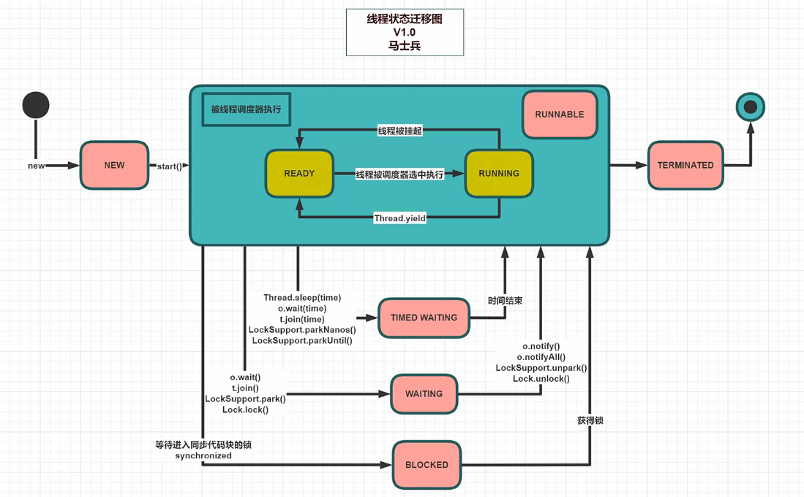

## 多线程与高并发（三）：线程的状态

### 1.java的6种线程状态

1. NEW：线程刚刚创建，还没有启动；
2. RUNNABLE：可运行状态，由线程调度器可以安排执行；
3. WAITING：等待被唤醒；
4. TIMED WAITING：隔一段时间后自动唤醒；
5. BLOCKED：被阻塞，正在等待锁；
6. TERMINATED：线程结束；




- 案例

```java
package com.lele.juc.c_000_threadbasic;

import com.lele.util.SleepHelper;

import java.sql.SQLOutput;
import java.util.concurrent.TimeUnit;
import java.util.concurrent.locks.Lock;
import java.util.concurrent.locks.LockSupport;
import java.util.concurrent.locks.ReentrantLock;

/**
 * @author: lele
 * @date: 2021/11/16 7:41
 * @description:
 */
public class T04_ThreadState {

    public static void main(String[] args) throws Exception {

        /*************************************************/
        Thread t1 = new Thread(() -> {
            // 输出当前线程的状态
            System.out.println("2: " + Thread.currentThread().getState());
            for (int i = 0; i < 3; i++) {
                SleepHelper.sleepSeconds(1);
                System.out.print(i + " ");
            }
            System.out.println();
        });
        System.out.println("1: " + t1.getState());
        t1.start();
        t1.join();
        System.out.println("3: " + t1.getState());
        /*************************************************/

        /*************************************************/
        Thread t2 = new Thread(() -> {
            try {
                LockSupport.park(); // 让自己阻塞住
                System.out.println("t2 go on!");
                TimeUnit.SECONDS.sleep(5);
            } catch (InterruptedException e) {
                e.printStackTrace();
            }
        });
        /*************************************************/

        /*************************************************/
        final Object o = new Object();
        Thread t3 = new Thread(() -> {
            synchronized (o) {
                System.out.println("t3 得到了锁 o");
            }
        });

        new Thread(() -> {
            synchronized (o) {
                SleepHelper.sleepSeconds(5);
            }
        }).start();

        SleepHelper.sleepSeconds(1);

        t3.start();
        SleepHelper.sleepSeconds(1);
        System.out.println("6: " + t3.getState()); // t3申请不到锁（synchronized）的时候，就是blocked
        /*************************************************/

        /*************************************************/
        final Lock lock = new ReentrantLock(); //JUC的锁（CAS，waiting）
        Thread t4 = new Thread(() -> {
            lock.lock(); //省略try finally
            System.out.println("t4 得到了锁 o");
            lock.unlock();
        });

        new Thread(() -> {
            lock.lock();
            SleepHelper.sleepSeconds(5);
            lock.unlock();
        }).start();

        SleepHelper.sleepSeconds(1);

        t4.start();
        SleepHelper.sleepSeconds(1);
        System.out.println("7: " + t4.getState());
        /*************************************************/

        /*************************************************/
        Thread t5 = new Thread(() -> {
            LockSupport.park();
        });

        t5.start();

        SleepHelper.sleepSeconds(1);

        System.out.println("8: " + t5.getState());
        LockSupport.unpark(t5);
        /*************************************************/
    }
}
```

```java
package com.lele.util;

import java.util.concurrent.TimeUnit;

/**
 * @author: lele
 * @date: 2021/11/17 7:42
 * @description:
 */
public class SleepHelper {
    public static void sleepSeconds(int seconds) {
        try {
            TimeUnit.SECONDS.sleep(seconds);
        } catch (InterruptedException e) {
            e.printStackTrace();
        }
    }
}
```
