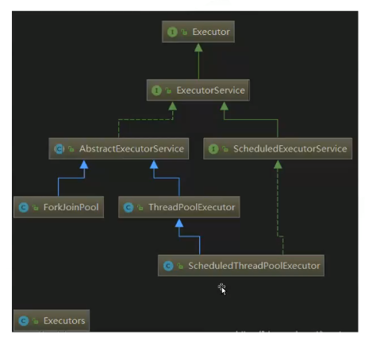

## 多线程与高并发（八）：Java多线程体系

### 1.线程的创建

#### 1.1 继承Thread
1. 定义Thread类的子类，并重写该类的run方法，该方法的方法体就代表了线程要完成的任务。因此把run()方法称为执行体；
2. 创建Thread子类的实例，即创建了线程对象；
3. 调用线程对象的start()方法来启动线程；

  ```java
  public class DemoThread extends Thread {
    public void run() {
      System.out.println("hello");
    }

    public static void main(String[] args) {
      new DemoThread().start();
    }
  }
  ```

#### 1.2 实现Runnable
1. 定义Runnable接口的实现类，并重写该接口的run()方法，该run()方法的方法体同样是该线程的线程执行体；
2. 创建Runnable实现类的实例，并以此实例作为Thread的target来创建Thread对象，该Thread对象才是真正的线程对象；
3. 调用线程对象的start()方法来启动该线程；

```java
public class Demo implements Runnable {
  public void run() {
    System.out.println("hello");
  }
  public static void main(String[] args) {
    Demo de = new Demo();
    new Thread(de, "新线程").start();
  }
}
```

#### 1.3 实现Callable与Future
1. 创建Callable接口的实现类，并实现call()方法，该call()方法将作为线程执行体，并且有返回值；

    ```java
    public interface Callable {
      V call() throws Exception;
    }
    ```

2. 创建Callable实现类的实例，使用FutureTask类来包装Callable对象，该FutureTask对象封装了该Callable对象的call()方法的返回值。（FutureTask是一个包装器，它通过接受Callable来创建，它同时实现了Future和Runnable接口）；
3. 使用FutureTask对象作为Thread对象的target创建并启动新线程；
4. 调用FutureTask对象的get()方法来获得子线程执行结束后的返回值；

  ```java
  public class Demo implements Callable<Integer> {
    public static void main(String[] args) {
      Demo demo = new Demo();
      FutureTask<Integer> ft = new FutureTask<>(demo);
      new Thread(ft, "有返回值的线程").start();
      ft.get();
    }

    @Override
    public Integer call() throws Exception {
      return 1;
    }
  }
  ```

### 2.常用线程池体系结构
1. Executor：线程池顶级接口；
2. ExecutorService：线程池次级接口，对Executor做了一些扩展，增加了一些功能；
3. ScheduleExecutorService：对ExecutorService做了一些扩展，增加了一些定时任务相关的功能；
4. AbstractExecutorService：抽象类，运用模板方法设计模式实现了一部分方法；
5. ThreadPoolExecutor：普通线程池类，包含最基本的一些线程池操作相关的方法实现；
6. ScheduledThreadPoolExecutor：定时任务线程池类，用于实现定时任务相关功能；
7. ForkJoinPool：新型线程池类，java7中新增的线程池类，基于工作窃取理论实现，运用与大任务拆小任务，任务无限多的场景；
8. Executors：线程池工具类，定义了一些快速实现线程池的方法；

  

#### 2.1 Executor
> 线程池顶级接口，定义了一个执行无返回值任务的方法；

```java
public interface Executor {
  /**
   * 执行无返回值任务
   * 根据Executor的实现判断，可能是在新线程、线程池、线程调用中执行
   */
   void execute(Runnable command);
}
```

#### 2.2 ExecutorService

```java
public interface ExecutorService extends Executor {

  // 关闭线程池，不再接受新任务，但已经提交的任务会执行完成
  void shutdown();

  /**
   * 立即关闭线程池，尝试停止正在运行的任务，未执行的任务不再执行
   * 被迫停止及未执行的任务将以列表的形式返回
   */
   List<Runnable> shutdownNow();

   // 检查线程池是否已关闭
   boolean isShutdown();

   // 检查线程池是否已终止，只有在shutdown()或者shutdownNow()之后调用才有可能为true
   boolean isTerminated();

   // 在指定时间内线程池达到终止状态了才会返回true
   boolean awaitTermination(long timeout. TimeUnit unit) throws InterruptedException;

   // 执行有返回值的任务，任务的返回值为task.call()的结果
   <T> Fututre<T> submit(Callable<T> task);

   /**
    * 执行有返回值的任务，任务的返回值为这里传入的result
    * 当然只有当任务执行完成了调用get()时才会返回
    */
    <T> Future<T> submit(Runnable task, T result);

    /**
     * 执行有返回值的任务，任务的返回值为null
     * 当然只有当任务执行完成了调用get()时才会返回
     */
    Future<?> submit(Runnable task);

    // 批量执行任务，只有当这些任务都完成了这个方法才会返回
    <T> List<Future<T>> invokeAll(Collection<? extends Callable<T>> tasks)
        throws InterruptedException;

    /**
     * 在指定时间内批量执行任务，未执行完成的任务将被取消
     * 这里的timeout是所有任务的总时间，不是单个任务的时间
     */
    <T> List<Future<T>> invokeAll(Collection<? extends Callable<T>> tasks,
                                  long timeout, TimeUnit unit)
        throws InterruptedException;

    // 返回任意一个已完成任务的执行结果，未执行完成的任务将被取消
    <T> T invokeAny(Collection<? extends Callable<T>> tasks)
        throws InterruptedException, ExecutionException;

    // 在指定时间内如果有任务已完成，则返回任意一个已完成任务的执行结果，未执行完成的任务将被取消
    <T> T invokeAny(Collection<? extends Callable<T>> tasks,
                    long timeout, TimeUnit unit)
        throws InterruptedException, ExecutionException, TimeoutException;
}
```

#### 2.3 AbstractExecutorService
> 抽象类，运用模板方法设计模式实现了一部分方法；

看源码


#### ScheduledExecutorService
> 对ExecutorService做了一些扩展，增加一些定时任务相关的功能，主要包含两大类：执行一次、重复多次执行；

```java
public interface ScheduleExecutorService extends ExecutorService {

  /**
   * 在指定的延时后执行一次
   * 参数：delay 从现在开始到延时执行的时间； unit  延时时间单位
   */
  public ScheduledFuture<?> schedule(Runnable command,
                                       long delay, TimeUnit unit);

  // 在指定的延时后执行一次
  public <V> ScheduledFuture<V> schedule(Callable<V> callable,
                                           long delay, TimeUnit unit);

  /**
   * 在指定延时后首先执行一次，随后按照周期执行，不包含任务执行的时间
   * 参数：initialDelay 第一次执行时间；    period  两次执行的时间间隔，不包含上一个任务执行时间
   * 第一次执行时间：initialDelay
   * 第二次执行时间：initialDelay + period
   * 第三次执行时间：initialDelay + 2*period
   */
  public ScheduledFuture<?> scheduleAtFixedRate(Runnable command,
                                                  long initialDelay,
                                                  long period,
                                                  TimeUnit unit);

  /**
   * 在指定延时后首先执行一次，随后按照指定延时重复执行，相当于包含任务执行的时间
   * 参数：initialDelay 第一次延时执行的时间；
   *      delay 一个任务执行结束到另一个任务开始执行之间的延迟，延时以上一个任务结束开始计算
   */
  public ScheduledFuture<?> scheduleWithFixedDelay(Runnable command,
                                                     long initialDelay,
                                                     long delay,
                                                     TimeUnit unit);
}
```
