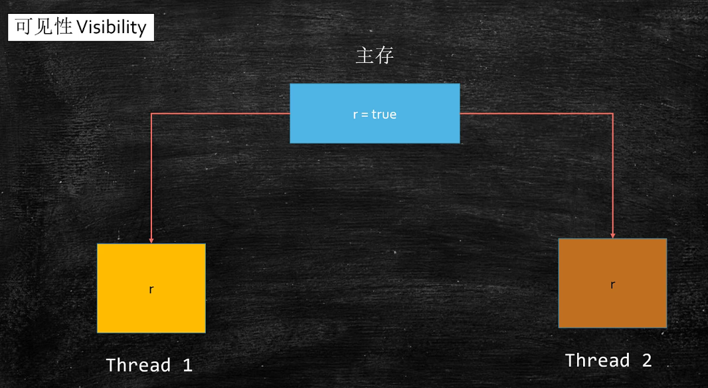
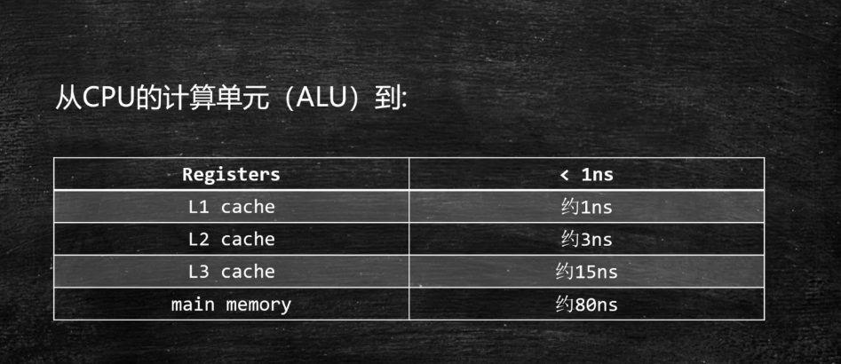
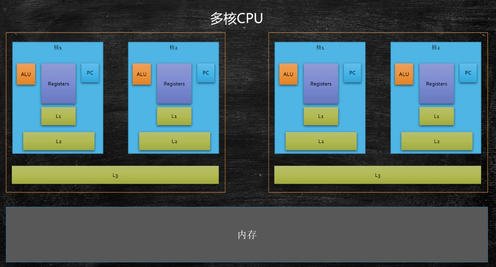
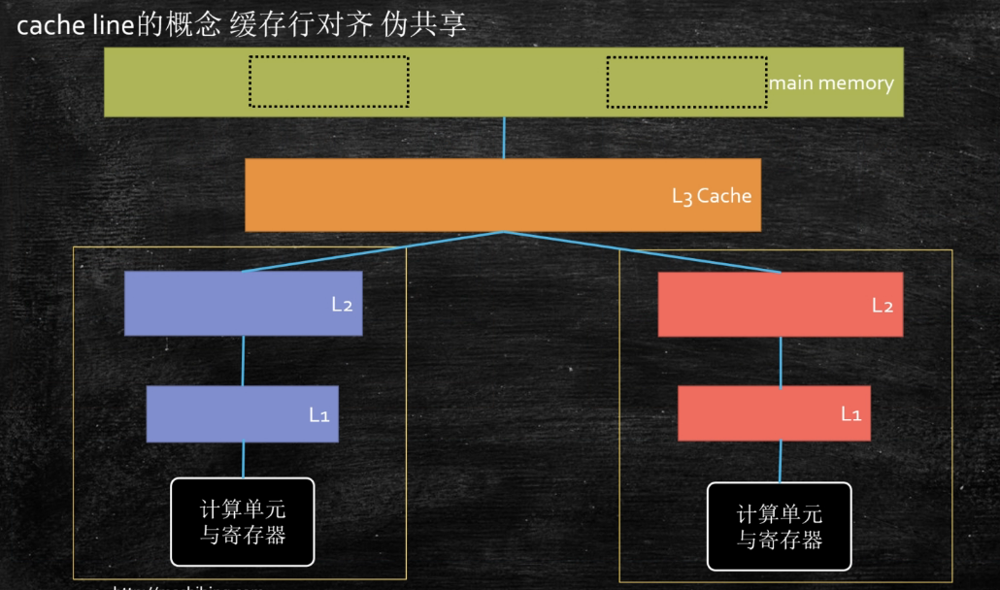
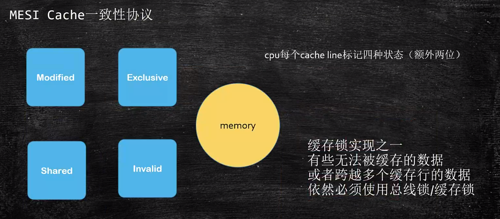
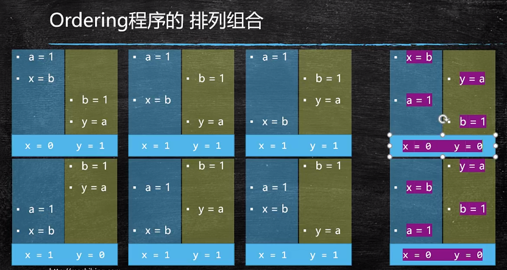
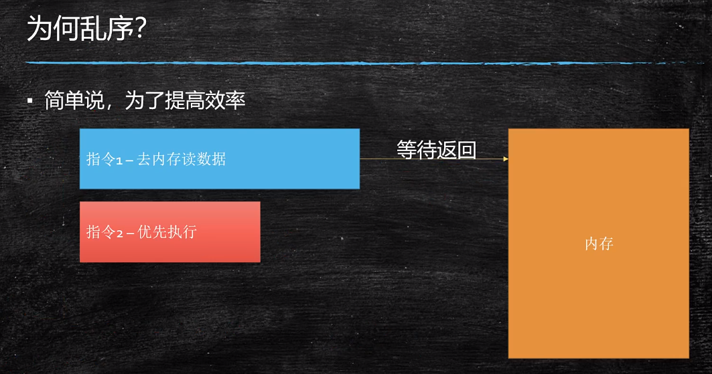

## 多线程与高并发（六）：并发编程三大特性

- 可见性（visibility）
- 有序性（ordering）
- 原子性（atomicity）

### 1.可见性

  

- 每个线程在运行的时候，都会把数据从内存中读出一份放在线程本地（线程缓存，不是Threadlocal），以后每次循环读取的值不是去主内存读，而是读取自己本地的缓存，不会主动去主内存里面主动读取；
- 默认情况下，一个线程改了某个值，另一个线程是看不见被改的值；
- volatile：
  - 保持线程的可见性（volatile修饰的内存，每次都会去主内存里面读一遍，对于它的任何的修改，其他线程立马可见）；
  - 保持可见性不一定要使用volatile；

  ```java
  package com.lele.c_001_00_Visibility;

  import com.lele.util.SleepHelper;

  /**
   * @author: lele
   * @date: 2021/11/25 21:57
   * @description:
   */
  public class T01_HelloVolatile {

      // 用volatile修饰，running值被改动时，其他线程也可见（volatile的保持线程的可见性）
      private static volatile boolean running = true;  // 主内存中；
      private static void m() {
          System.out.println("m start");
          while (running) {
  //            System.out.println("hello");  // 触发了可见性
          }
          System.out.println("m end!");
      }

      public static void main(String[] args) {

          new Thread(T01_HelloVolatile::m, "t1").start();

          SleepHelper.sleepSeconds(1);

          running = false;

      }
  }
  ```

  - volatile 引用类型（包括数组）只能保证引用本身的可见性，不能保证内部字段的可见性

  ```java
  package com.lele.c_001_00_Visibility;

  import com.lele.util.SleepHelper;

  /**
   * @author: lele
   * @date: 2021/11/28 21:31
   * @description: volatile 引用类型（包括数组）只能保证引用本身的可见性，不能保证内部字段的可见性
   */
  public class T02_VolatileReference {

      private static class A {
          boolean running = true;
          void m() {
              System.out.println("m start");
              while (running) {

              }
              System.out.println("m end");
          }
      }

      private volatile static A a = new A();

      public static void main(String[] args) {
          new Thread(a::m, "t1").start();
          SleepHelper.sleepSeconds(1);
          a.running = false;
      }
  }
  ```

#### 1.1 三级缓存

  

  

  Registers(寄存器中)取数顺序：L1、L2、L3、内存

#### 1.2 缓存行
- 按块读取（缓存行）：程序局部性原理，可以提高效率，充分发挥总线CPU针脚等一次性读取更多数据的能力；
- 缓存行越大，局部性空间效率越高，但读取时间慢；缓存行越小，局部性空间效率越低，但读取时间块；取一个折中值，目前多用：64字节

  

  - 一个缓存行大小为64字节
  - 通过变量凑字节数（64字节），来避免同一个缓存中数据被多个CPU修改时，相互干扰，进而提高效率；
  - 缓存行概念与 volatile 概念没有关系

  ```java
  package com.lele.juc.c_001_02_FalseSharing;

  import java.util.concurrent.CountDownLatch;

  /**
   * @author: lele
   * @date: 2021/12/1 7:35
   * @description:
   */
  public class T01_CacheLinePadding {
      public static long COUNT = 10_0000_0000L;

      private static class T {
          private long p1,p2,p3,p4,p5,p6,p7; // 避免同一个缓存中数据被多个CPU修改时，相互干扰
          public long x = 0L;  // 8字节，一个缓存行64字节
          private long p9,p10,p11,p12,p13,p14,p15;
      }

      public static T[] arr = new T[2];

      static {
          arr[0] = new T();
          arr[1] = new T();
      }

      public static void main(String[] args) throws Exception {
          CountDownLatch latch = new CountDownLatch(2);

          Thread t1 = new Thread(() -> {
              for (long i = 0; i < COUNT; i++) {
                  arr[0].x = i;
              }

              latch.countDown();
          });

          Thread t2 = new Thread(() -> {
              for (long i = 0; i < COUNT; i++) {
                  arr[1].x = i;
              }

              latch.countDown();
          });

          final long start = System.nanoTime();
          t1.start();
          t2.start();
          latch.await();
          System.out.println((System.nanoTime() - start)/100_0000);
      }
  }
  ```

#### 1.3 Disruptor中缓存行对齐的写法
> 基本上就是采用上面代码中的写法

**@Contended**（只有jdk1.8起作用）
- 保证当前行所在缓存行不会与其他缓存行混在一起；
- 用此注解时，需要在JVM中加一个参数：-XX:-RestrictContended

```java
package com.lele.juc.c_001_02_FalseSharing;

import sun.misc.Contended;

import java.util.concurrent.CountDownLatch;

/**
 * @author: lele
 * @date: 2021/12/5 11:27
 * @description:
 */
public class T05_Contended {
    public static long COUNT = 10_0000_0000L;

    private static class T {
        @Contended  //保证当前行所在缓存行不会与其他缓存行混在一起; 用此注解时，需要在JVM中加一个参数：-XX:-RestrictContended
        public long x = 0L;
    }

    public static T[] arr = new T[2];

    static {
        arr[0] = new T();
        arr[1] = new T();
    }

    public static void main(String[] args) throws Exception {
        CountDownLatch latch = new CountDownLatch(2);

        Thread t1 = new Thread(() -> {
            for (long i = 0; i < COUNT; i++) {
                arr[0].x = i;
            }

            latch.countDown();
        });

        Thread t2 = new Thread(() -> {
            for (long i = 0; i < COUNT; i++) {
                arr[1].x = i;
            }

            latch.countDown();
        });

        final long start = System.nanoTime();
        t1.start();
        t2.start();
        latch.await();
        System.out.println((System.nanoTime() - start)/100_0000);
    }
}
```

#### 1.4 硬件层面的缓存一致性

  


### 2.有序性

#### 2.1 乱序的验证

  

```java
package com.lele.juc.c_001_03_Ordering;

import java.util.concurrent.CountDownLatch;

/**
 * @author: lele
 * @date: 2021/12/5 15:25
 * @description:
 */
public class T01_Disorder {
    private static int x = 0, y = 0;
    private static int a = 0, b = 0;

    public static void main(String[] args) throws InterruptedException {

        for (long i = 0; i < Long.MAX_VALUE; i++) {
            x = 0;
            y = 0;
            a = 0;
            b = 0;
            CountDownLatch latch = new CountDownLatch(2);

            Thread one = new Thread(new Runnable() {
                @Override
                public void run() {
                    a = 1;
                    x = b;

                    latch.countDown();
                }
            });

            Thread other = new Thread(new Runnable() {
                @Override
                public void run() {
                    b = 1;
                    y = a;

                    latch.countDown();
                }
            });

            one.start();
            other.start();
            latch.await();
            String result = "第" + i + "次（" + x + "," + y + "）";
            if (x == 0 && y == 0) {
                System.out.println(result);
                break;
            }
        }
    }
}
```

#### 2.2 为何乱序？

  

- 简单说，为了提高效率
- 什么时候会发生乱序执行？
  - 前后两条语句没有依赖关系

- 乱序存在的条件：
  - as-if-serial：单线程的程序，看上去像串行程序
  - 不影响单线程的最终一致性


**可见性与有序性问题**

```java
package com.lele.juc.c_001_03_Ordering;

/**
 * @author: lele
 * @date: 2021/12/5 17:08
 * @description:
 */
public class T02_NoVisibility {

    private static boolean ready = false;  // 加 volatile 保证其可见性  1.可见性问题
    private static int number;

    private static class ReaderThread extends Thread {
        @Override
        public void run() {
            while(!ready) {
                Thread.yield();
            }
            System.out.println(number); // 有可能为0
        }
    }

    public static void main(String[] args) throws Exception {
        ReaderThread t = new ReaderThread();
        t.start();
        number = 42; // 当前行与下一行在CPU执行时候，可能会换顺序  2.有序性问题
        ready = true;
        t.join();
    }
}
```

**this对象逸出（还未初始化完成就直接被用了）**
- 一般来讲，构造方法中可以new Thread，但不要在构造方法中启动线程，若要启动线程，需单独写一个方法；

```java
package com.lele.juc.c_001_03_Ordering;

import java.io.IOException;

/**
 * @author: lele
 * @date: 2021/12/5 18:17
 * @description: this对象逸出（还未初始化完成就直接被用了）
 * 一般来讲，构造方法中可以new Thread，但不要在构造方法中启动线程，若要启动线程，需单独写一个方法；
 */
public class T03_ThisEscape {

    private int num = 8;

    public T03_ThisEscape() {
        new Thread(() -> {
//            System.out.println(num); // 理论上有可能输出中间状态值0
            System.out.println(this.num);
        }).start();
    }

    public static void main(String[] args) throws Exception {
        new T03_ThisEscape();
        System.in.read();
    }
}
```

### 3.原子性

从一个小程序谈起

```java
package com.lele.juc.c_001_sync_basics;

import java.util.concurrent.CountDownLatch;

/**
 * @author: lele
 * @date: 2021/12/6 7:38
 * @description:
 */
public class T00_00_IPlusPlus {

    private static long n = 0L;

    public static void main(String[] args) throws Exception {

        Thread[] threads = new Thread[100];
        CountDownLatch latch = new CountDownLatch(threads.length);

        for (int i = 0; i < threads.length; i++) {
            threads[i] = new Thread(() -> {
                for (int j = 0; j < 10000; j++) {
//                    synchronized (T00_00_IPlusPlus.class) {
                        n++;
//                    }
                }
                latch.countDown();
            });
        }

        for (Thread t : threads) {
            t.start();
        }

        latch.await();

        System.out.println(n);
    }
}
```

- race condition => 竞争条件，指的是多线程访问共享数据的时候会产生竞争；
- 数据的不一致（unconsistency），并发访问之下产生的不期望出现的结果；
- 如何保障数据一致呢？--> 线程同步（线程执行的顺序安排好）
  - 具体：保障操作的原子性（Atomicity）
    - 1.悲观的认为这个操作会被别的线程打断（悲观锁）synchronized（上一个小程序）
    - 2.乐观的认为这个操作不会被别的线程打断（乐观锁）cas操作；（CAS = Compare And Set/Swap/Exchange）
