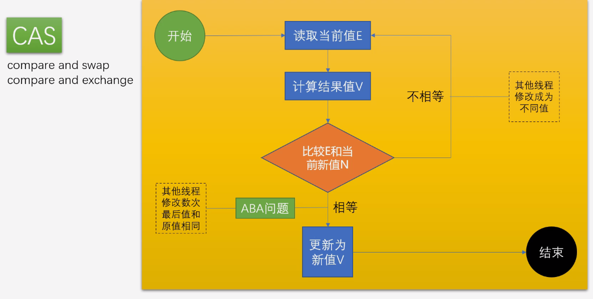
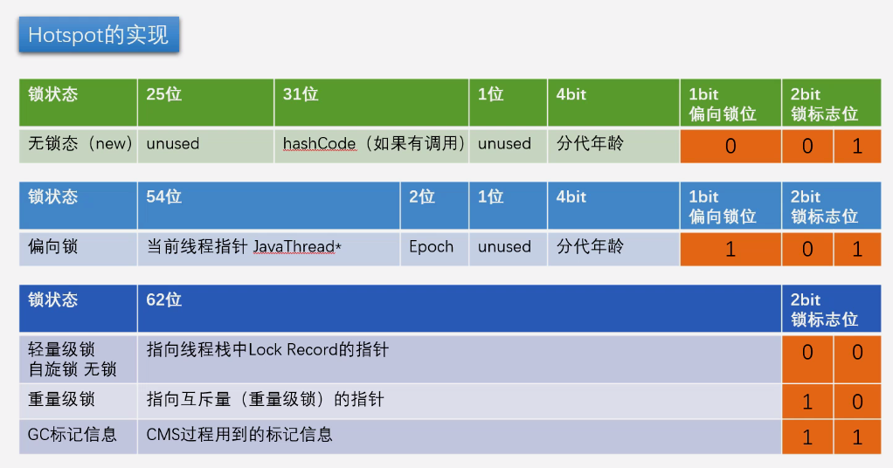
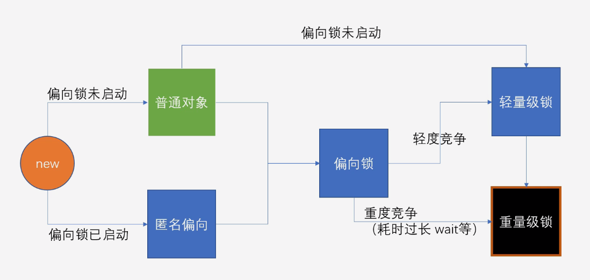

## 多线程与高并发：synchronize新版深入详解

### 1. 用户态和内核态
Intel指令分为 ring0~ring3 级；

- 内核态：执行在内核空间，可以访问所有的指令（ring0）；
- 用户态：只能访问用户可以访问的指令（ring3）；

JDK早期，synchronized 叫做重量级锁， 因为申请锁资源必须通过kernel, 系统调用。
- 重量级锁：JVM加锁，需要从用户态到内核态的一个调用（0x80），即从操作系统中申请锁；


```assembly
;hello.asm
;write(int fd, const void *buffer, size_t nbytes)

section data
    msg db "Hello", 0xA
    len equ $ - msg

section .text
global _start
_start:

    mov edx, len
    mov ecx, msg
    mov ebx, 1 ;文件描述符1 std_out
    mov eax, 4 ;write函数系统调用号 4
    int 0x80

    mov ebx, 0
    mov eax, 1 ;exit函数系统调用号
    int 0x80

```

### 2. CAS
- Compare And Swap（Compare And Exchange）/自旋/自旋锁/无锁（无重量锁）
- 因为经常配合循环操作，直到完成为止，所以泛指一类操作；
- cas(v,a,b)，变量v，期待值a，修改b；
- ABA问题，你的女朋友在离开你的这段时间经历了别人，自旋就是你空转等待，一直等到它接纳你为止；
  - 解决办法：（版本号AtomicStampedReference），基础类型简单值不需要版本号；




### 3. Unsafe

- AtomicInteger:

  ```java
  public final int incrementAndGet() {
      for (;;) {
          int current = get();
          int next = current + 1;
          if (compareAndSet(current, next))
              return next;
      }
  }

  public final boolean compareAndSet(int expect, int update) {
      return unsafe.compareAndSwapInt(this, valueOffset, expect, update);
  }
  ```

- Unsafe:

  ```java
  public final native boolean compareAndSwapInt(Object var1, long var2, int var4, int var5);
  ```

- 运用：

  ```java
  package com.mashibing.jol;

  import sun.misc.Unsafe;

  import java.lang.reflect.Field;

  public class T02_TestUnsafe {

      int i = 0;
      private static T02_TestUnsafe t = new T02_TestUnsafe();

      public static void main(String[] args) throws Exception {
          //Unsafe unsafe = Unsafe.getUnsafe();

          Field unsafeField = Unsafe.class.getDeclaredFields()[0];
          unsafeField.setAccessible(true);
          Unsafe unsafe = (Unsafe) unsafeField.get(null);

          Field f = T02_TestUnsafe.class.getDeclaredField("i");
          long offset = unsafe.objectFieldOffset(f);
          System.out.println(offset);

          boolean success = unsafe.compareAndSwapInt(t, offset, 0, 1);
          System.out.println(success);
          System.out.println(t.i);
          //unsafe.compareAndSwapInt()
      }
  }
  ```

- jdk8u: unsafe.cpp:
- cmpxchg = compare and exchange

  ```c++
  UNSAFE_ENTRY(jboolean, Unsafe_CompareAndSwapInt(JNIEnv *env, jobject unsafe, jobject obj, jlong offset, jint e, jint x))
    UnsafeWrapper("Unsafe_CompareAndSwapInt");
    oop p = JNIHandles::resolve(obj);
    jint* addr = (jint *) index_oop_from_field_offset_long(p, offset);
    return (jint)(Atomic::cmpxchg(x, addr, e)) == e;
  UNSAFE_END
  ```

- jdk8u: atomic_linux_x86.inline.hpp **93行**
- is_MP = Multi Processor

  ```c++
  inline jint     Atomic::cmpxchg    (jint     exchange_value, volatile jint*     dest, jint     compare_value) {
    int mp = os::is_MP();
    __asm__ volatile (LOCK_IF_MP(%4) "cmpxchgl %1,(%3)"
                      : "=a" (exchange_value)
                      : "r" (exchange_value), "a" (compare_value), "r" (dest), "r" (mp)
                      : "cc", "memory");
    return exchange_value;
  }
  ```

- jdk8u: os.hpp is_MP()

  ```c++
  static inline bool is_MP() {
    // During bootstrap if _processor_count is not yet initialized
    // we claim to be MP as that is safest. If any platform has a
    // stub generator that might be triggered in this phase and for
    // which being declared MP when in fact not, is a problem - then
    // the bootstrap routine for the stub generator needs to check
    // the processor count directly and leave the bootstrap routine
    // in place until called after initialization has ocurred.
    return (_processor_count != 1) || AssumeMP;
  }
  ```

- jdk8u: atomic_linux_x86.inline.hpp

  ```c++
  #define LOCK_IF_MP(mp) "cmp $0, " #mp "; je 1f; lock; 1: "
  ```

  - MP：multi processor多个处理器

- 最终实现：
  - cmpxchg = cas修改变量值

  ```assembly
  #加锁是为保证操作的原子性（CAS在比较并写的时候不是原子操作）
  lock cmpxchg 指令
  ```

- 硬件：

  - lock指令在执行后面指令的时候锁定一个北桥信号

  - （不采用锁总线的方式）

### 4. markword
#### 对象在内存中的布局（JVM hotspot实现）
- 8字节markword
- 4字节class pointer（默认开启压缩，压缩之后是4字节）
- 成员变量（int占4字节）

**要求对象8字节对齐：对象的大小（字节数）必须是8的整数倍，若不够则凑成8的整数倍**

### 5. 工具：JOL = Java Object Layout

```xml
<dependencies>
    <!-- https://mvnrepository.com/artifact/org.openjdk.jol/jol-core -->
    <dependency>
        <groupId>org.openjdk.jol</groupId>
        <artifactId>jol-core</artifactId>
        <version>0.9</version>
    </dependency>
</dependencies>
```

```java
import org.openjdk.jol.info.ClassLayout;

/**
 * 加入锁处于偏向状态，这时来了竞争者，那么它的状态是什么？
 */

public class HelloJOL {
  public static void main(String[] args) throws Exception {
    //Thread.sleep(5000);

    Object o = new Object();
    System.out.println(ClassLayout.parseInstance(o).toPrintable());

    synchronized(o) {
      System.out.println(ClassLayout.parseInstance(o).toPrintable());
    }
  }
}
```

- 给对象上锁，在hotspot中实现是修改对象的markword；

jdk8u: markOop.hpp

```java
// Bit-format of an object header (most significant first, big endian layout below):
//
//  32 bits:
//  --------
//             hash:25 ------------>| age:4    biased_lock:1 lock:2 (normal object)
//             JavaThread*:23 epoch:2 age:4    biased_lock:1 lock:2 (biased object)
//             size:32 ------------------------------------------>| (CMS free block)
//             PromotedObject*:29 ---------->| promo_bits:3 ----->| (CMS promoted object)
//
//  64 bits:
//  --------
//  unused:25 hash:31 -->| unused:1   age:4    biased_lock:1 lock:2 (normal object)
//  JavaThread*:54 epoch:2 unused:1   age:4    biased_lock:1 lock:2 (biased object)
//  PromotedObject*:61 --------------------->| promo_bits:3 ----->| (CMS promoted object)
//  size:64 ----------------------------------------------------->| (CMS free block)
//
//  unused:25 hash:31 -->| cms_free:1 age:4    biased_lock:1 lock:2 (COOPs && normal object)
//  JavaThread*:54 epoch:2 cms_free:1 age:4    biased_lock:1 lock:2 (COOPs && biased object)
//  narrowOop:32 unused:24 cms_free:1 unused:4 promo_bits:3 ----->| (COOPs && CMS promoted object)
//  unused:21 size:35 -->| cms_free:1 unused:7 ------------------>| (COOPs && CMS free block)
```

### 7. 锁升级过程
#### 7.1 JDK8 markword实现表：



- 偏向锁：上偏向锁，指的就是，把markword的线程ID改为自己线程ID的过程；
  - 偏向锁不可重偏向 批量偏向 批量撤销；

**用户空间锁 VS 重量级锁**
- 偏向锁、自旋锁 都是在用户空间完成；
- 重量级锁是需要向内核申请；


- 锁升级初步



  - new -> 普通对象 -> 加synchronize -> 偏向锁 -> 轻度竞争 -> 轻量级锁（自旋锁或无锁） -> 竞争加剧 -> 重量级锁
